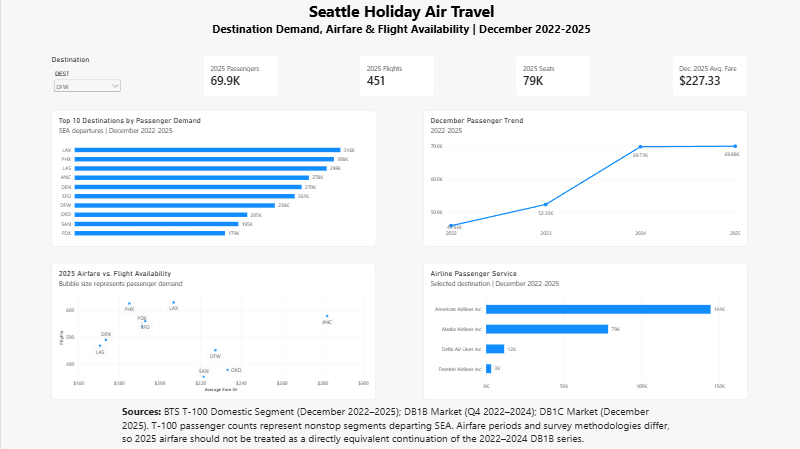
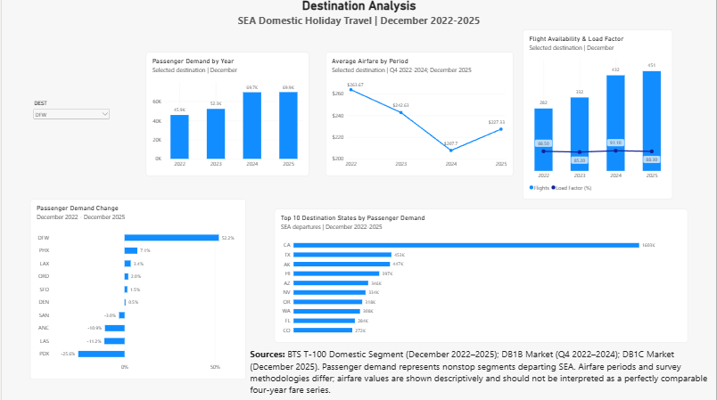

# Seattle Holiday Air Travel Analysis

## Project Overview

This project analyzes domestic air travel from Seattle-Tacoma International Airport (SEA) during the December holiday travel period from 2022 through 2025.

The analysis combines passenger demand, flight availability, seat capacity, load factor, airline service, and airfare data to identify popular destinations and examine how travel patterns have changed over time.

The final analysis focuses on the Top 10 destination airports by total December passenger volume from SEA and uses Power BI to present the results through an interactive two-page dashboard.

## Business Question

Which U.S. destinations are most popular for travelers departing Seattle during the December holiday travel period, and how do the Top 10 destinations compare in passenger demand, airfare, and flight availability?

## Analysis Questions

1. Which domestic destinations receive the most December travelers from SEA?
2. What are the Top 10 destination airports by passenger volume?
3. Which destination states receive the most SEA travelers?
4. How has passenger demand for the Top 10 destinations changed from December 2022 to December 2025?
5. Which destinations provide the greatest flight and seat availability?
6. Which airlines provide the most service to the Top 10 destinations?
7. Which Top 10 destinations have the lowest typical airfare?
8. How do the Top 10 destinations compare in airfare, passenger demand, and flight availability?

## Data Sources

### BTS T-100 Domestic Segment

Passenger demand, flight activity, seat capacity, airline service, and route information were obtained from the U.S. Department of Transportation Bureau of Transportation Statistics (BTS) T-100 Domestic Segment dataset.

The analysis uses December data for:

- December 2022
- December 2023
- December 2024
- December 2025

Only records with Seattle-Tacoma International Airport (`SEA`) as the origin were included.

Key fields used in the analysis include:

- Passengers
- Departures performed
- Seats
- Distance
- Reporting carrier / carrier name
- Origin airport
- Destination airport
- Destination city and state
- Year and month

T-100 passenger counts represent passengers traveling on nonstop flight segments departing SEA. Therefore, they should not be interpreted as passengers' final destinations when a trip includes a connection.

### BTS DB1B Market

Airfare data for 2022 through 2024 was obtained from the BTS Airline Origin and Destination Survey DB1B Market dataset.

The analysis uses:

- Q4 2022
- Q4 2023
- Q4 2024

DB1B is a quarterly 10% sample of airline tickets. Because DB1B is quarterly, these airfare values represent the fourth quarter (October–December), rather than December alone.

To better align the airfare analysis with the nonstop SEA routes analyzed in T-100, DB1B records were restricted to:

- Origin = `SEA`
- Top 10 destination airports
- `MktCoupons = 1`
- `MktFare > 0`

Passenger-weighted average market fares were calculated as:

`Sum(MktFare × Passengers) / Sum(Passengers)`

### BTS DB1C Market

December 2025 airfare data was obtained from the BTS DB1C Market dataset.

For the 2025 airfare analysis, DB1C Market was used instead of DB1B Market. DB1C provides monthly Origin and Destination Survey data using a 40% sample of tickets.

For this project, DB1C records were restricted to:

- Reporting year = 2025
- Reporting month = December
- Origin = `SEA`
- Top 10 destination airports
- `Nonstop = 1`
- `MktAmount > 0`

The December 2025 data contained one passenger per analyzed record, so the passenger-weighted mean and simple mean produce the same result. The weighted calculation was retained for consistency with the earlier DB1B processing.

## Methodology

### 1. Passenger Demand

T-100 December records from 2022 through 2025 were combined and filtered to flights departing SEA.

Passenger totals were aggregated by destination airport. Destinations were then ranked using total December passenger volume across all four years.

The 10 highest-demand destination airports were selected for the main dashboard analysis.

### 2. Yearly Demand and Capacity

For each Top 10 destination, the analysis calculated annual December:

- Passenger volume
- Flights performed
- Available seats
- Load factor

Load factor was calculated using aggregated passenger and seat totals:

`Load Factor = Total Passengers / Total Seats × 100`

This avoids averaging individual row-level load factors.

### 3. Airline Service

Passenger-carrying T-100 records were grouped by destination and airline to measure airline service within the Top 10 routes.

Records with zero passengers were excluded from the passenger-service analysis.

### 4. Airfare Analysis

Airfare represents the average reported market amount in the BTS Origin and Destination Survey data and should not be interpreted as a live quoted ticket price.

Airfare records were filtered to nonstop markets to improve comparability with the nonstop segment structure of the T-100 analysis.

Non-positive airfare observations were excluded. High fares were not arbitrarily removed solely because of their value.

Average fares were calculated using passenger weighting where applicable.

### 5. 2025 Balance Analysis

The 2025 analysis compares three dimensions for the Top 10 destinations:

- Passenger demand
- Average airfare
- Flight availability

These measures are displayed together in the Power BI dashboard rather than being combined into an arbitrary overall score. This allows users to evaluate the tradeoff between price, demand, and service availability directly.

## Airfare Comparability Limitation

The airfare series should be interpreted carefully.

The 2022–2024 airfare values come from DB1B Market, which is a quarterly 10% sample and represents Q4 (October–December). The 2025 value comes from DB1C Market, which uses a 40% sample and represents December specifically.

Because the survey methodology, sample size, and reporting period differ, the 2025 airfare value should not be treated as a perfectly equivalent continuation of the 2022–2024 DB1B series.

The airfare values are therefore used primarily for descriptive comparison. The December 2025 DB1C airfare data is especially useful for the 2025 cross-sectional comparison of airfare, passenger demand, and flight availability.

## Scope and Limitations

- The analysis covers domestic travel departing `SEA`.
- Passenger and operational data covers December 2022–2025.
- T-100 passenger counts represent nonstop flight segments rather than complete passenger itineraries.
- The project analyzes December as the holiday/New Year travel period but does not isolate travel specifically occurring on New Year's Eve or New Year's Day.
- The Top 10 airports are determined by combined December passenger demand across 2022–2025.
- DB1B 2022–2024 airfare data represents Q4, while DB1C 2025 airfare data represents December.
- DB1B and DB1C sample passenger counts are not used as substitutes for T-100 passenger-demand totals.

## Tools and Technologies

The project uses the following tools:

- **Python** — data cleaning, filtering, aggregation, validation, and analysis
- **pandas** — data manipulation and creation of analysis-ready datasets
- **Jupyter Notebook** — development and documentation of the data analysis workflow
- **PyArrow** — reading the 2025 DB1C Parquet dataset
- **Visual Studio Code** — project development environment
- **Power BI Desktop** — data modeling, interactive visualization, and dashboard development
- **GitHub** — planned project repository and portfolio presentation

## Data Processing Workflow

The analysis was completed in three main stages.

### 1. T-100 Demand Analysis

December T-100 files for 2022, 2023, 2024, and 2025 were imported and combined using Python and pandas.

The data was then:

1. Filtered to records with `SEA` as the origin.
2. Aggregated by destination airport to calculate passenger demand.
3. Ranked by total December passenger volume across 2022–2025.
4. Filtered to the Top 10 destination airports for detailed analysis.
5. Aggregated by year to examine changes in passenger demand.
6. Aggregated to calculate flights, seats, and load factor.
7. Grouped by airline and destination to analyze passenger service.
8. Grouped by destination state to compare geographic demand.

### 2. Airfare Analysis

DB1B Market data for Q4 2022, Q4 2023, and Q4 2024 was processed separately from the December 2025 DB1C Market data.

For DB1B:

1. Records were filtered to `SEA` as the origin.
2. Only the Top 10 destinations were retained.
3. Markets were restricted to one coupon (`MktCoupons = 1`) to represent nonstop markets.
4. Non-positive fares were removed.
5. Passenger-weighted average fares were calculated for each destination.

For DB1C:

1. December 2025 records were selected.
2. Records were filtered to `SEA` as the origin and the Top 10 destinations.
3. Only nonstop markets (`Nonstop = 1`) were retained.
4. Missing and non-positive market amounts were removed.
5. Average market amounts were calculated for each destination.

The resulting airfare datasets were combined into analysis-ready tables while retaining the distinction between DB1B Q4 data and DB1C December data.

### 3. Dashboard Preparation

Processed datasets were exported as CSV files and loaded into Power BI.

The final processed files include:

- `master_top10_destinations.csv` — overall Top 10 destination metrics and airfare
- `top10_yearly_demand.csv` — yearly passenger, flight, seat, and load factor metrics
- `top10_airfare_2022_2025.csv` — destination-level airfare comparison
- `top10_airfare_long_2022_2025.csv` — long-format airfare data for time-based visuals
- `top10_2025_balance.csv` — December 2025 demand, airfare, flights, seats, and rankings
- `airline_by_destination_top10.csv` — airline service by Top 10 destination
- `airline_service_top10.csv` — overall airline service across the Top 10 destinations
- `state_demand.csv` — passenger demand by destination state

Power BI relationships were created primarily using destination airport code (DEST) to connect the destination-level tables and support interactive filtering across related dashboard visuals.

The dashboard was organized into two report pages:

- **Overview** — summarizes Top 10 destination demand, 2025 operating metrics, airfare versus flight availability, passenger trends, and airline service.
- **Destination Analysis** — provides destination-level demand trends, airfare comparison, flight availability, load factor, demand change, and destination-state demand.

## Key Findings

### 1. Los Angeles Had the Highest Overall Passenger Demand

Los Angeles (LAX) was the highest-demand destination from SEA across the combined December 2022–2025 period, with 315,904 passengers.

The Top 3 destinations were:

1. LAX — 315,904 passengers
2. PHX — 308,110 passengers
3. LAS — 299,459 passengers

These results show that Los Angeles, Phoenix, and Las Vegas were consistently among the largest December nonstop passenger markets from Seattle.

### 2. California Was the Largest Destination State

California received approximately 1.60 million December passengers from SEA across 2022–2025, substantially more than any other destination state in the analysis.

Texas and Alaska followed with approximately 453,000 and 447,000 passengers, respectively.

### 3. DFW Experienced the Strongest Passenger Growth

Among the Top 10 destinations, Dallas/Fort Worth (DFW) had the largest increase in December passenger demand between 2022 and 2025.

DFW passenger volume increased from 45,928 passengers in December 2022 to 69,883 in December 2025, an increase of approximately 52.2%.

Phoenix (PHX) increased by 7.1%, while Los Angeles (LAX) increased by 3.4% over the same period.

### 4. PDX Experienced the Largest Passenger Decline

Portland (PDX) showed the largest decline among the Top 10 destinations between December 2022 and December 2025.

Passenger volume decreased from 50,963 to 37,905, representing a decline of approximately 25.6%.

Las Vegas (LAS) and Anchorage (ANC) also declined by approximately 11.2% and 10.9%, respectively.

### 5. Flight Availability Varied Considerably Across Destinations

The analysis found meaningful differences in the number of flights and available seats among the Top 10 destinations.

High passenger demand did not always correspond directly with the same level of flight availability or aircraft capacity. Comparing passengers, flights, seats, and load factor provides a more complete picture of route activity than passenger totals alone.

### 6. Alaska Airlines Provided the Most Passenger Service

Across the Top 10 destinations, Alaska Airlines carried the largest passenger volume during the December 2022–2025 period.

This was followed by Delta Air Lines, with other major carriers including United Airlines, American Airlines, and Southwest Airlines.

The airline mix also varied by destination, showing that carrier competition and service patterns differed across SEA routes.

### 7. December 2025 Airfares Varied Across the Top 10

Using the December 2025 DB1C Market data, average fares among the Top 10 destinations ranged from approximately $170.65 to $282.22.

Las Vegas (LAS) had the lowest average fare at approximately $170.65, while Anchorage (ANC) had the highest at approximately $282.22.

Because the 2025 airfare data comes from DB1C while the 2022–2024 values come from DB1B Q4 data, the historical airfare values are presented descriptively rather than treated as a perfectly comparable four-year series.

### 8. Price, Demand, and Flight Availability Show Different Tradeoffs

The 2025 comparison shows that no single measure fully describes a destination market.

Some destinations combine relatively low airfare with high flight availability, while others have strong passenger demand despite higher average fares or fewer flights.

For this reason, the dashboard presents airfare, passenger demand, and flight availability together rather than assigning destinations a single overall score.

## Conclusion

This project examined December domestic air travel from Seattle-Tacoma International Airport (SEA) from 2022 through 2025 by combining passenger demand, flight availability, seat capacity, airline service, and airfare data.

The analysis identified Los Angeles (LAX) as the highest-demand destination across the four-year period, while California received the highest overall passenger volume among destination states. Demand patterns also changed differently across routes, with Dallas/Fort Worth (DFW) showing the largest increase among the Top 10 destinations from December 2022 to December 2025 and Portland (PDX) showing the largest decline.

The 2025 analysis further demonstrates that passenger demand alone does not fully describe a route. Airfare and flight availability vary considerably across destinations, creating different tradeoffs for travelers. The Power BI dashboard brings these measures together so users can interactively compare destinations rather than relying on a single ranking.

Overall, the project demonstrates how multiple public aviation datasets can be cleaned, combined, validated, and visualized to provide a more complete view of holiday air travel patterns from Seattle.

## Dashboard

The final Power BI dashboard contains two interactive report pages.

### Overview

The Overview page provides a high-level summary of Seattle holiday air travel and includes:

- 2025 passenger, flight, seat, and airfare KPIs
- Top 10 destinations by passenger demand
- December passenger trends from 2022–2025
- 2025 airfare versus flight availability comparison
- Airline passenger service by selected destination
- Interactive destination filtering

### Destination Analysis

The Destination Analysis page provides a deeper examination of route and geographic patterns, including:

- Passenger demand by year
- Passenger demand change from December 2022 to December 2025
- Average airfare by period
- Flight availability and load factor
- Top 10 destination states by passenger demand
- Interactive destination filtering

## Project Structure

Seattle-Holiday-Air-Travel-Analysis/
│
├── Dashboard/
│   ├── Seattle_Holiday_Air_Travel_Dashboard.pbix
│   ├── destination_analysis.png
│   └── overview.png
│
├── Data/
│   ├── processed/
│   │   └── Analysis-ready CSV files
│   │
│   └── raw/
│       └── Source data excluded from GitHub
│
├── Notebooks/
│   ├── 01_t100_demand_analysis.ipynb
│   ├── 02_airfare_analysis.ipynb
│   └── 03_master_analysis.ipynb
│
├── .gitignore
└── README.md